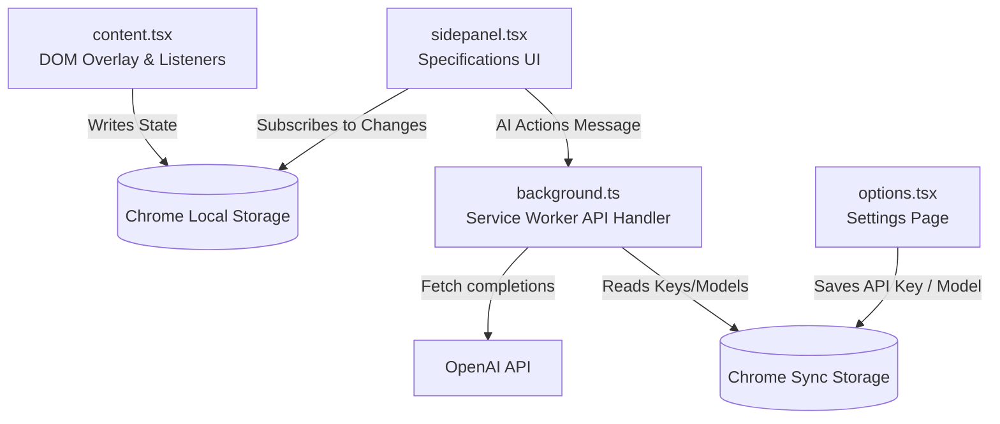

# 🔍 PixInspect: AI-Powered Visual CSS Analyzer & Design Inspector

PixInspect is a modern, design-focused Chrome Extension that simplifies inspect workflows for frontend developers and UI/UX designers. Inspired by clean, minimal aesthetics, it parses element layouts, harvests design assets, and leverages AI to explain styles or rebuild components.

Built with **React**, **TypeScript**, and **Plasmo**, PixInspect integrates directly into the Google Chrome `SidePanel` for an unobstructed, sleek developer experience.

---

## ✨ Core Features

### 1. Interactive Visual Inspector (CSS Peeper Style)
- **Precise Overlays**: Hover over page elements to visualize padding (green), margins (orange), and content dimensions (blue).
- **Metadata Badges**: Instantly view tag names, unique IDs, classes, and exact viewport dimensions at the cursor point.
- **Deep DOM Scopes**: Supports pseudo-elements (`::before` / `::after`) and extracts css `@keyframes` configurations.

### 2. Intelligent Style Harvester (Pruned CSS & Tailwind)
- **Style Diffing**: Compares the target element against a temporary sandbox dummy to isolate user-authored CSS, discarding browser-agent noise.
- **Tailwind Converter**: Live translation of calculated styling declarations into Tailwind CSS classes, including arbitrary compiler fallbacks (e.g. `bg-[#f5f5f0]` or `[clip-path:polygon(...)]`).
- **One-Click Export**: Clipboard utility to copy structural CSS JSON and parsed Tailwind utilities instantly.

### 3. AI Copilot (OpenAI GPT-4o Integration)
- **Explain UI**: Understand the architectural design decisions, layout flow, and component structures of any element on the page.
- **Build React**: Converts the selected DOM node and its isolated styles into clean, production-ready React components styled with Tailwind CSS.

### 4. Global Page Collectors
- **Typography Scanner**: Aggregates all font families deployed across the entire page, complete with responsive fonts rendering previews.
- **Unified Color Palette**: Sweeps all backgrounds, text, and borders to display a clean grid of HEX codes (filtering out default browser blues).
- **Asset Harvester**: Collects images, background cover images, and inline SVGs. Supports direct downloads or copying of SVG XML source codes.

### 5. Design System DNA Profile
- **Global Extraction**: Analyzes page density, font sizes, margins/paddings, radii, and shadows to identify the underlying design patterns.
- **DNA Kit Export**: Generates and downloads setup configurations (`tailwind.config.js` and `base.css` variables) mapping the site's unique system tokens.

---

## 🏗️ Technical Architecture & Directory Structure

PixInspect uses the [Plasmo extension framework](https://www.plasmo.com/) to build, watch, and package assets. State sharing is managed through Chrome's sync and local storage channels, maintaining reactivity between the page overlays and the side panel.



### 📂 Directory Overview

- **`src/content.tsx`**: Active tab content script. Manages canvas overlays, mouse position tracking, dimension labels, and page-wide asset harvesting.
- **`src/sidepanel.tsx`**: Chrome sidebar UI. Hosts the core inspector pane, global asset grid, typography lists, color palettes, and AI buttons.
- **`src/background.ts`**: Persistent extension service worker. Resolves SidePanel launcher hooks and interfaces securely with the OpenAI API.
- **`src/options.tsx`**: User settings page. Captures, validates, and stores local configuration values (OpenAI API key and model type).
- **`src/utils/`**:
  - `styleExtractor.ts`: Coordinates element queries and styles calculations.
  - `exactExtractor.ts`: Creates virtual nodes to diff page-specific styles from default agent defaults.
  - `tailwindConverter.ts`: Converts pure CSS attributes into Tailwind configuration utilities.
  - `dnaExtractor.ts`: Parses DOM nodes to construct global spacing, radii, font size, and shadow frequency scales.
  - `pageAnalyzer.ts`: Iterates elements to compile overall lists of active fonts and HEX colors.
  - `assetExtractor.ts`: Harvests inline SVGs, regular elements, and stylesheets `background-image` links.

---

## 🛠️ Installation & Getting Started

### 📋 Prerequisites
Ensure you have **Node.js (v18+)** and **npm** installed.

### 🚀 Setup Dev Environment

1. Clone the repository:
   ```bash
   git clone https://github.com/govardhanprabhavathi/pixinspect.git
   cd pixinspect
   ```

2. Install dependencies:
   ```bash
   npm install
   ```

3. Launch Plasmo development server:
   ```bash
   npm run dev
   ```

4. Load the extension in Google Chrome:
   - Go to `chrome://extensions/`
   - Turn on **Developer mode** (top right toggle).
   - Click **Load unpacked** (top left).
   - Select the `build/chrome-mv3-dev` directory created by Plasmo.

---

## ⚙️ Configuration (AI Copilot Setup)

To use the AI-powered Explainer and React Component Generator:
1. Right-click the PixInspect extension icon and select **Options** (or click the Settings gear icon inside the SidePanel UI).
2. Enter your **OpenAI API Key**.
3. Select your preferred model (e.g., `GPT-4o` for rich responses, or `GPT-3.5 Turbo` for budget-friendly generation).
4. Click **Save Settings**.

---

## 🧬 Design System & Tech Stack

- **Framework**: React 18 & TypeScript
- **Styling**: Tailwind CSS & Vanilla CSS (Tailwind config extends a premium, minimal, cream-toned theme)
- **Bundler**: Plasmo (Manifest V3)
- **Icons**: Lucide React
- **API integration**: Direct OpenAI Chat completions pipeline

---

## 📄 License
This project is licensed under the MIT License.
